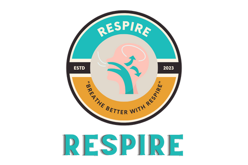

# Respire - Clean Air, Bright Futures

 <!-- Replace with a link to your project's logo -->

## Table of Contents

- [Overview](#overview)
- [Folders](#folders)
- [Technologies Used](#technologies-used)
- [Features](#features)
- [Getting Started](#getting-started)
- [Contributing](#contributing)
- [License](#license)

## Overview

"Respire" is an innovative project committed to combating air pollution and ensuring that every individual has access to clean and healthy air. Our comprehensive solution leverages cutting-edge technologies, including IoT, machine learning, blockchain, and mobile applications, to empower users with real-time air quality information and actionable insights.

### Key Features

- Real-time Air Quality Monitoring
- Machine Learning Analysis
- Blockchain-Based Reward System
- Web and Android Applications
- Location Mapping with OpenStreetMap
- Secure Authentication with Auth0

## Folders

- **Frontend**: Contains code and resources for the project's web and mobile app frontends.
- **Backend**: Houses the backend server code implemented using Node.js and JavaScript.
- **Godaddy Domain**: Relevant files and documentation related to your domain registration.
- **Streamlit**: Frontend files and code related to the Streamlit framework for machine learning analysis.
- **Circuit Design**: Design and documentation for IoT device circuits.
- **Bill of Materials**: Contains a list of materials required for your IoT device.

## Technologies Used

- Backend: Node.js, JavaScript
- Mobile App: Kotlin
- Database: MongoDB
- Blockchain: Hedera Hashgraph
- Location Mapping: OpenStreetMap (OSM)
- Authentication: Auth0
- Design and Graphics: Figma, Canva

## Getting Started

To get started with "Respire," follow these steps:

1. Clone the repository: `git clone https://github.com/felixop7/Project-Respire`
2. Set up the backend server using Node.js.
3. Set up the frontend for web and mobile using the Kotlin.
4. Configure MongoDB and Auth0 as per the provided documentation.
5. Integrate Hedera Hashgraph for the reward system.
6. Deploy your application to your preferred hosting service.

For detailed installation and usage instructions, refer to the individual folders in this repository.

## Contributing

We welcome contributions from the community! If you'd like to contribute to "Respire," please follow our [Contributing Guidelines](CONTRIBUTING.md).

## License

This project is licensed under the [MIT License](LICENSE).
